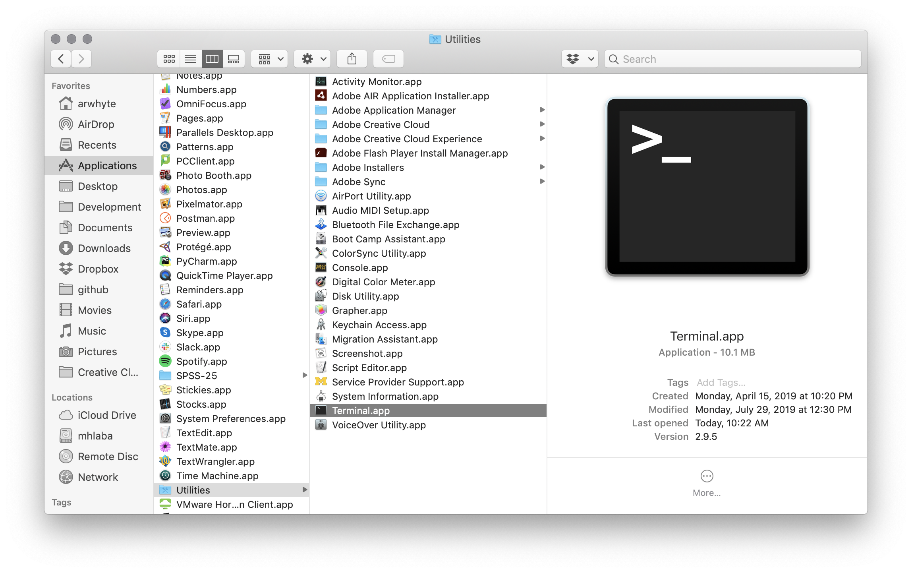
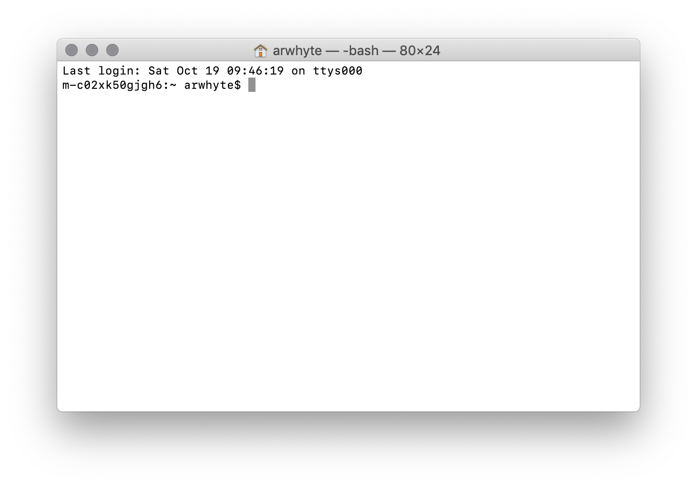
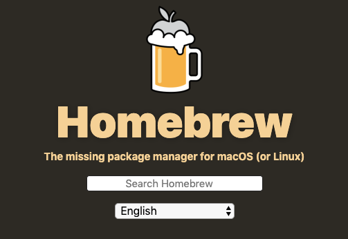

# macOS: Using Homebrew to Install and Maintain Python 3
I do my development work on a Mac. I use [Homebrew](https://brew.sh/), a macOS package manager, to acquire and maintain 
a number of software packages that I use on a daily basis, including Python.

The Homebrew approach is but one way to manage software installs. In the case of Python on a Mac it is often described 
as the [recommended way](https://python-docs.readthedocs.io/en/latest/starting/install3/osx.html) to install and 
maintain it.

:warning: If you are new to issuing commmands in a terminal environment, I recommend installing Python using the 
[Python Foundation's](https://www.python.org/) Python 3 package installer as described in [macOS: Installing Python 3](mac-install_python.md).
The approach is straightforward and involves fewer steps than what is described below.

## 1.0 Locate and open Terminal.app
Mac includes a Unix terminal called `Terminal.app` that you can use to issue Bash shell commands. Use `Finder` to locate 
`Terminal.app` in the directory `Applications/Utilities/`. You can traverse the directory structure by clicking on 
each folder or use the keyboard shortcut: (`Command + Shift + U`). 

I recommend dragging the `Terminal.app` icon to your dock in order to simplify accessing `Terminal.app` in future 
(you will be using it frequently).



Double-click Terminal.app's icon to open it. The terminal opens with a white background. If you want to change the 
background color see the following _StackExchange_
[thread](https://apple.stackexchange.com/questions/92756/how-do-you-change-mac-terminal-theme-so-that-it-doesnt-go-back-to-basic-every).



:exclamation: To close a terminal session type 'exit' and then press __Return__ key.

## 2.0 Check if Python is installed
Type the following line `python --version` and then press the __Return__ key: 

```cmd
$ python --version
Python 2.7.10
```

Mac comes with Python 2.7.x pre-installed. You need Python 3. Check and see if you have Python 3.x:

```cmd
$ python3 --version
Python 3.7.4
```

If Python 3.7.x or 3.8.0 (newly released) is installed you are in good shape and need do nothing more. The more likely 
scenario is that no version information is returned. No problem, let's install Python 3.

:warning: If Python 3 is _already_ installed on your machine, proceed no further. Switching to Homebrew will require that
you delete your current Python installation. Doing so is not difficult for the experienced user. However, for
inexperienced users I recommend that you hold off using Homebrew to manage your Python installs until you have gained
more experience working on the command line.

:bulb: If Python 3.x is installed but the version is not the latest (currently 3.8.0), consider running Dr Chuck's 
Python 3 [uninstaller](https://github.com/csev/uninstall-python3) shell script. Then reinstall Python 3 using Homebrew.  

## 3.0 Install Xcode</a>
[Xcode](https://developer.apple.com/xcode/) is Apple's integrated development environment (IDE). Homebrew requires 
access to Xcode's developer tools.  First, check if Xcode is already installed:
 
```commandline
$ xcode-select -p
/Library/Developer/CommandLineTools
```

If no path value is returned, install Apple's Xcode package:

```commandline
$ xcode-select --install
```

Click your way through the confirmation screens and allow Xcode time to install (it's a large install).

:bulb: You can also obtain Xcode from the Apple App store (it's free).

## 4.0 Install Homebrew</a>



Once you have Xcode installed you can now install [Homebrew](https://brew.sh/). Homebrew describes itself as 
"the missing package manager for macOS".  I use it to manage curl, Git, GnuPG, Heroku, Hugo, Maven, nano, OpenSSL, 
Pandoc, Python, Ruby, SQLite and a number of other software installs. In future UMSI courses you are likely to use a
number of these software packages.

Open the terminal (I use [iTerm2](https://www.iterm2.com/)) and run the following script to install Homebrew:  

```commandline
$ /usr/bin/ruby -e "$(curl -fsSL https://raw.githubusercontent.com/Homebrew/install/master/install)"
```

Once installed, confirm that Homebrew is healthy and ready to `brew`:

```commandline
$ brew doctor
Your system is ready to brew.
```

## 5.0 Update the PATH environment variable using nano
Homebrew requires that the `/usr/local/bin` directory be listed first in your `PATH` environment 
variable. 

Use the command line text editor [nano](https://www.nano-editor.org/) to open your ~/.bash_profile:  

```commandline
$ nano ~/.bash_profile
```

If nano is not installed (e.g., the command fails) install it using the following Homebrew nano [formula]
(http://brewformulas.org/Nano):

```commandline
$ brew install nano
```

Once `~/.bash_profile` is open, add or edit a `PATH` environment variable listing `usr/local/bin` 
before any other directories referenced in `PATH`.

```commandline
export PATH="/usr/local/bin:$PATH"
``` 

Write out the change by holding down the __Control__ and __O__ keys (`CTRL - O`), then press the __Return__ 
key when "File Name to Write: .bash_profile" is displayed. Then exit nano by holding down the 
__Control__ and __X__ keys (`CTRL - X`).

To activate your `.bash_profile` changes in your current terminal session, issue the `source` command:

```commandline
$ source ~/.bash_profile
```

## 6.0 Install Python
Now let's install Python using Homebrew. 

:warning: As of 19 October 2019 the Homebrew Python [formula](https://formulae.brew.sh/formula/python) will install 
Python 3.7.4_1 __not__ Python 3.8.0. Expect the formula to be updated in the very near future.
  
Issue the following [formula](http://brewformulas.org/Python) to install Python 3.7.x 
(`pip` and `setuptools` are included):

```commandline
$ brew install python
```

Next, check with Python install location your terminal session recognizes:

```commandline
$ which python3
/usr/local/bin/python3
```

:bulb: If the path `/usr/local/bin/python3` is __not__ returned, recheck your `PATH` variable in `~/.bash_profile` and
add/update your `PATH` environment variable ensuring that `/usr/local/bin` is listed first per the directions above.  

Now confirm that Python 3 is installed:

```cmd
$ python3 --version
Python 3.7.4
```

:exclamation: Congratulations, you have installed Python successfully using Homebrew.

:warning: When you `brew install` formulae that provide Python bindings, you should not be in an active virtual 
environment.  See Homebrew Documentation: [Python](https://docs.brew.sh/Homebrew-and-Python.html).

## 7.0 Additional info
Get to know Homebrew by having a look at the official [Homebrew Documentation](https://docs.brew.sh/).
Andr&eacute; Mar&eacute;'s [Homebrew - Basic Commands and Cheatsheet](https://dev.to/code2bits/homebrew---basics--cheatsheet-3a3n)
is also a useful read.

Below are few useful commands that you are likely to use on a regular basis.

### 7.1 Returning a list of Homebrew commands
Type `brew help` in the terminal then press __Enter__ to retrieve a list of Homebrew commands:

```commandline
$ brew help
Example usage:
  brew search [TEXT|/REGEX/]
  brew info [FORMULA...]
  brew install FORMULA...
  brew update
  brew upgrade [FORMULA...]
  brew uninstall FORMULA...
  brew list [FORMULA...]

Troubleshooting:
  brew config
  brew doctor
  brew install --verbose --debug FORMULA

Contributing:
  brew create [URL [--no-fetch]]
  brew edit [FORMULA...]

Further help:
  brew commands
  brew help [COMMAND]
  man brew
  https://docs.brew.sh
```

### 7.2 Returning a list of installed packages
Type `brew list` in the terminal then press __Enter__ to return a list of installed packages:

```commandline
$ brew list --versions
```

### 7.3 Updating formulas and upgrading packages
Run the following commands periodically (I do so daily) in order to update formulas, upgrade packages, 
confirm installs, and delete outdated packages.

```commandline
$ brew update
$ brew upgrade
$ brew doctor
$ brew cleanup
```

## License
<a rel="license" href="http://creativecommons.org/licenses/by/4.0/"></a><br />This work is licensed under a <a rel="license" href="http://creativecommons.org/licenses/by/4.0/">Creative Commons Attribution 4.0 International License</a>.
