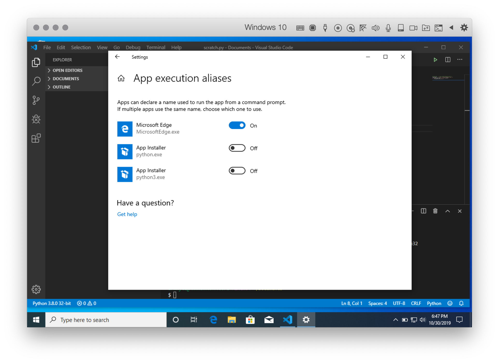
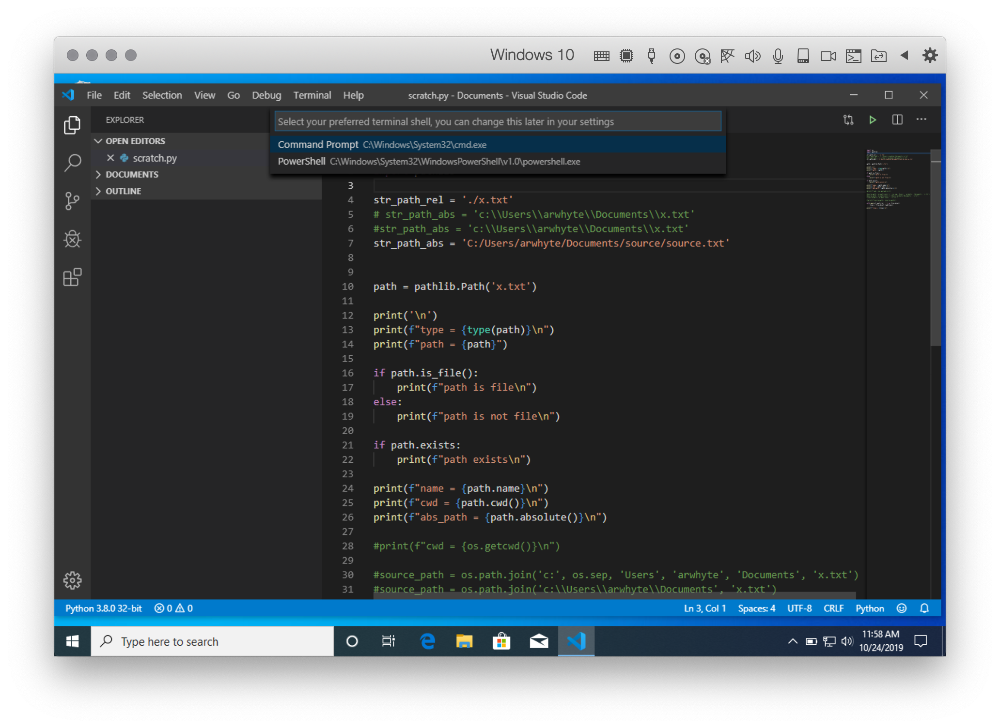
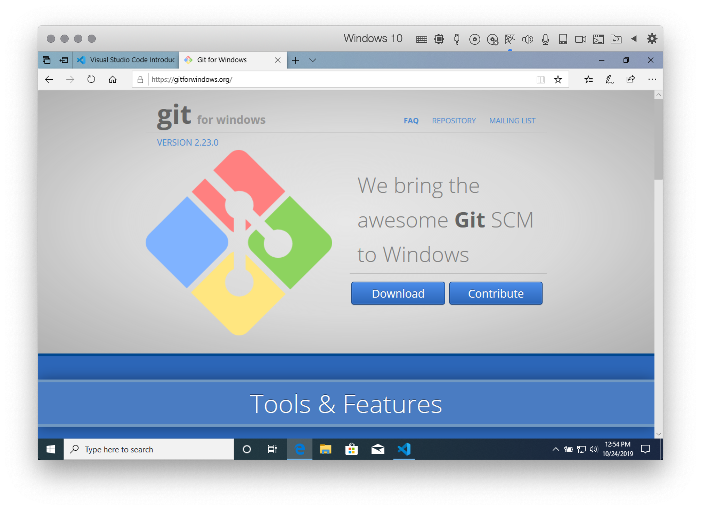
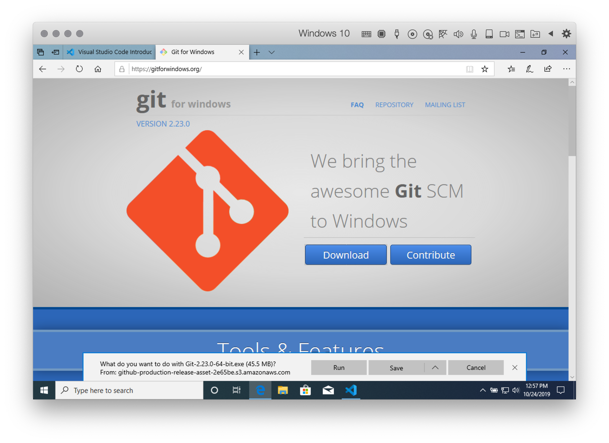
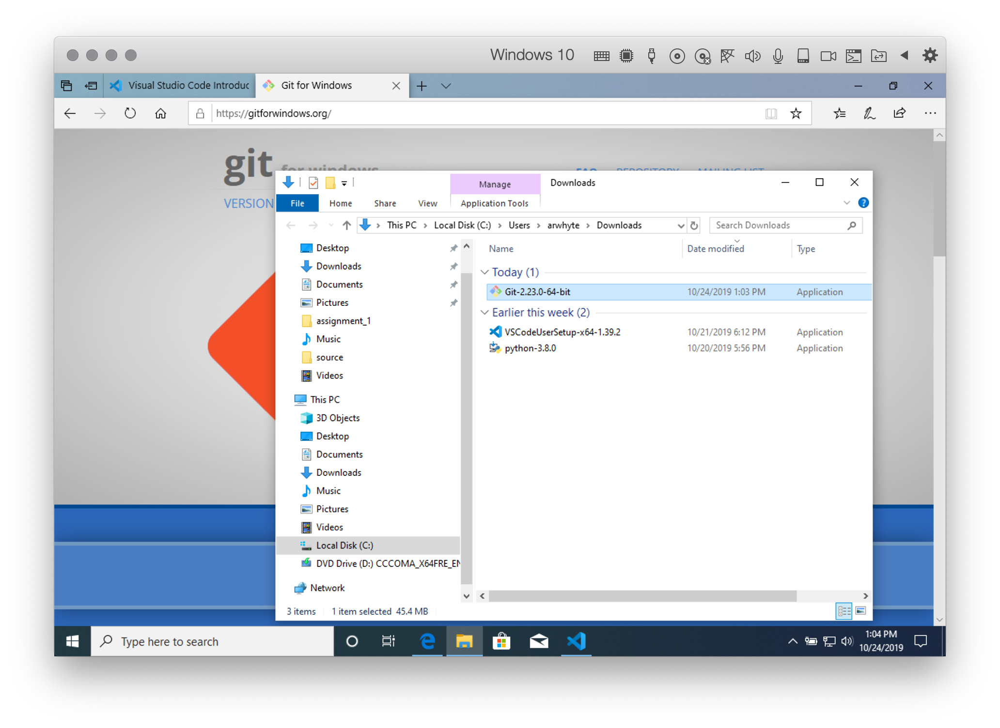
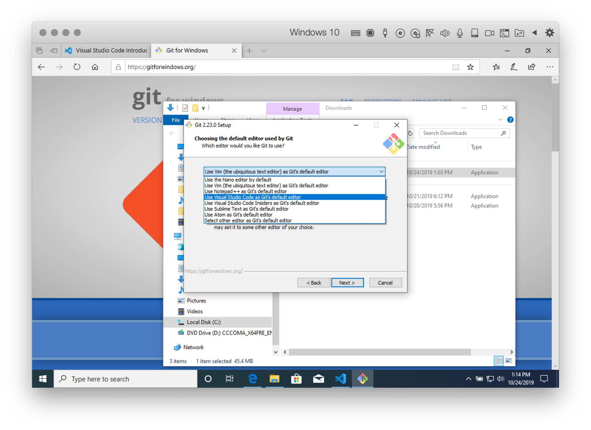
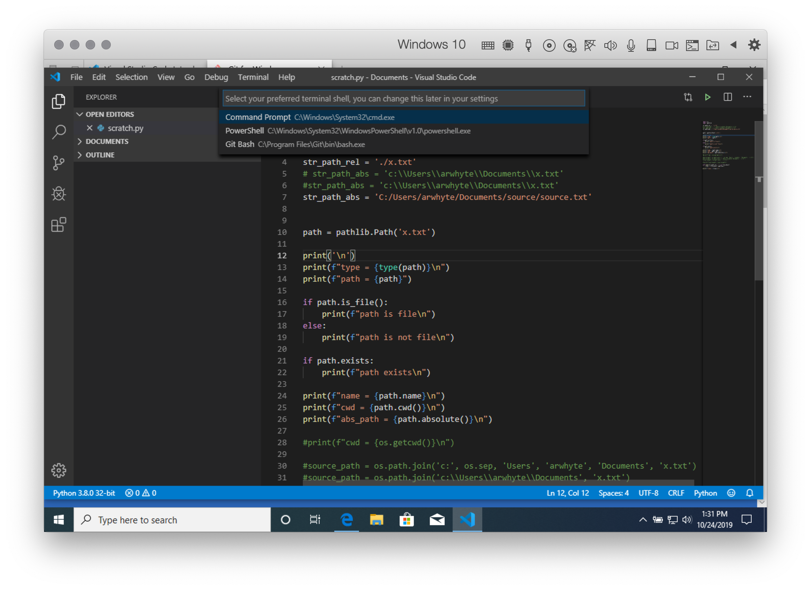
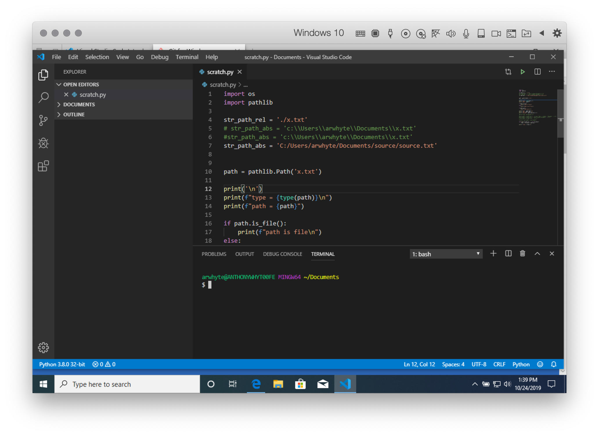

# Windows 10: Changing Visual Studio Code's default Terminal
Visual Studio Code (a.k.a VS Code) is a popular source code editor that runs on Windows, Mac, and Linux. It features
built-in support for a variety of software languages as well as extensions for languages such as Python.

Once you've installed the Python extension, you can run your Python code by pressing the green run button (>). 
Doing so will spawn a terminal session.

For Windows users VS Code's _default_ terminal is PowerShell. PowerShell was designed to automate other system
administration tasks using a scripting language relying on commands that are called "cmdlets". 

I recommend that you change the default terminal to either Command Prompt (cmd) or GitBash. Using GitBash requires 
downloading and installing the [git for windows](https://gitforwindows.org/) tool set and then changing VS Code's 
default terminal setting to use GitBash.

## Warning: VS Code GitBash terminal "Permission denied" issue 
:warning: Three Windows 10 users (May 2019 update, version 1903) who installed Python 3 using the Windows Store 
Python 3.8.0 or 3.7.5 installer have reported encountering a __Permission denied__ message after switching their default 
VS Code terminal to GitBash.

Two students have reported resolving the issue by uninstalling the Windows Store version of Python 3 and reinstalling 
Python 3 (3.8.0 or 3.7.5) using the Python Software Foundation's Python 3 installer. One student provided a
detailed set of uninstall/reinstall steps that resolves the issue:

1. Uninstall Python 3.8 / 3.7 obtained from the Windows Store
2. Disable App execution aliases "App Installer python.exe" and "App Installer python3.exe" (instructions below)
3. Uninstall gitforwindows
4. Uninstall VS Code
5. Install Python Software Foundation Python 3.8.0 (see [install guide](win-install_python_from_pysf.md))
6. Reinstall VS Code (see [install guide](win-install_vscode_with_py_extension.md))
7. Reinstall gitforwindows (this guide)
8. Change VS Code default terminal to GitBash (this guide)

:bulb: To uninstall Windows apps type "apps" in the Search box located on the taskbar. Then click on "Apps & Features".  
Scroll down and locate Python 3.8.0 (or 3.7.5) and the Python launcher. Click on each in turn, clicking the "Uninstall" 
button to remove them from the system. Then reinstall Python 3 using the Python Software Foundation installer per the
[Windows 10: Installing Python 3 (Python Software Foundation)](win-install_python_from_pysf.md) install guide. After
reinstalling Python 3 complete steps 2-7 described above.

:warning: You __must disable__ the App execution aliases "App Installer python.exe" and "App Installer python3.exe" in 
order to eliminate the "Permission denied" message in the VS Code terminal set to GitBash. These two aliases should have
 been removed by Windows when the Windows Store version of Python 3 was uninstalled (another bug). You must disable 
 these two aliases manually. 
 
 Type "manage app execution aliases" and then click on the light blue rectangle to open the system settings. 
 Then __turn off__ _both_ the "App Installer python.exe" and "App Installer python3.exe" aliases.

  
 
 :exclamation: Once the old Windows Store Python App installer aliases are disabled you can no longer start the Python 
 Interpreter by typing `python3` at the terminal prompt (you are limited to typing `python` only). You can confirm this
 change by typing at the PowerShell, Command Prompt or GitBash prompt `python3 --version` (no version number returned) and then `python --version` (version 
 number returned).

## 1.0 Change default terminal to Command Prompt
Switching VS Code's default terminal to Command Prompt involves a few steps.

1. Start up VS Code. 
2. Press __Ctrl__ + __Shift__ + __P__ to reveal a _searchable_ command menu. 
3. Type "shell" in the command menu search box. 
4. The search action will return "Terminal: Select Default Shell"

    

5. Click on "Terminal: Select Default Shell" entry.
6. You will be prompted to select your preferred terminal shell.
7. Select the option __Command Prompt: "Command Prompt: C:\Windows\System32\cmd.exe"__

     

8. If you are currently running a terminal session, click the delete icon (garbage can) in the terminal pane to 
terminate the current session.
9. From the taskbar press __Terminal__, then __New Terminal__ to start a new Command Prompt terminal session. You can
also type __Ctrl__ + __Shift__ + __'__ (yes, the keyboard shortcut includes a trailing single quotation mark (')) to 
start a new terminal session.

 

## 2.0 Change default terminal to Git Bash
[gitforwindows](https://gitforwindows.org/) provides a set of tools that permit Windows users
to utilize [Git](https://git-scm.com/), a distributed version control system. The SI 506
teaching team utilizes Git and the social computing platform [Github](https://github.com/) to produce docs and 
code collaboratively and maintain the full version history of our work in the cloud. If you don't yet have a Github 
account I encourage you to sign up for one (it's free). You will likely need a Github account at some point in 
your future coursework so creating one today is a good idea.

### 2.1 Install gitforwindows
Our immediate interest in [gitforwindows](https://gitforwindows.org/) is Bash shell it provides. It's called
 GitBash and VS Code can be configured easily to use it. But first you must download and install gitforwindows.

:bulb: some students have acquired gitforwindows from the [Git](https://git-scm.com/) site. The Git team does not produce
Windows installers; instead they simply point their links to the [gitforwindows](https://gitforwindows.org/) site.

1. Go to the site and click on the blue "Download" button to start the install process.

    

2. Click the grey "Save" button to commence the download of the tool set when prompted by Windows.

    

3. Once downloaded click the grey "Open folder" button.
4. Double-click the "Git-2.23.0-64-bit" installer icon.

    

5. Click the "Yes" button to allow the installer to app to make changes to your system.
6. The installer will now open.  
   1. Click the "Next" button to accept the license terms.
   2. Click the "Next" button to accept the default install location.
   3. Click the "Next" button to accept the default selection of components to be installed. 
      You can click the bottom checkbox "Check daily for Git for Windows updates" if you want to be alerted
      about updates.
   4. Click the "Next" button to accept the default Start Menu folder.
   5. :warning: Click the __dropdown__ and select __Visual Studio Code__ as Git's default editor. Then click the "Next"
      button.
   
      
   
   6. Click the "Next" button to accept the recommended configuration for using Git from the command line.
   7. Click the "Next" button to accept the default HTTPS transport backend.
   8. Click the "Next" button to accept the default line ending conversions (checkout Windows-style; commit 
      Unix-style line endings).
   9. Click the "Next" button to accept the default MinTTY terminal emulator.
   10. Click the "Next" button to accept the default extra options.
   11. Ignore the experimental options checkbox and click the "Install" button.
   12. __Uncheck__ the "View Release Notes" checkbox. Then click the "Finish" button.

### Configure Visual Studio Code to use GitBash
Now switch VS Code's default terminal to GitBash.

1. Start up or return to Visual Studio Code.  
2. Press __Ctrl__ + __Shift__ + __P__ to reveal the _searchable_ command menu. 
2. Type "shell" in the command menu search box. 
3. The search action will return "Terminal: Select Default Shell"

    

5. Click on "Terminal: Select Default Shell" entry.
6. You will be prompted to select your preferred terminal shell.
7. Select the option __GitBash: C:\Program Files\Git\bin\bash.exe__

    

8. If you are currently running a terminal session, click the delete icon (garbage can) in the terminal pane to 
terminate the current session.
9. From the taskbar press __Terminal__, then __New Terminal__ to start a new Command Prompt terminal session. You can
also type __Ctrl__ + __Shift__ + __'__ (yes, the keyboard shortcut includes a trailing single quotation mark (')) to 
start a new terminal session.

 

Congratulations. VS Code is now running a Bash shell in the terminal pane. 
