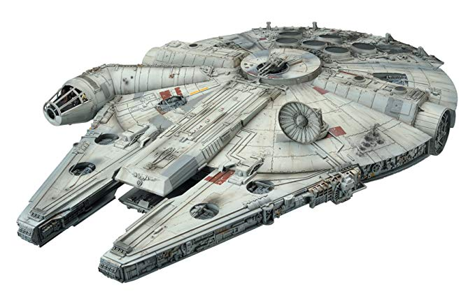

# Millennium Falcon exercise

## m_falcon.py
Use the `m_falcon.py` to work on the exercise.

## Objective
Rebel Alliance command requires a record of the starship named Millennium Falcon, a vessel used in
smuggling operations. Individuals who have flown this particular freighter are of particular 
interest and should be included as part of the data provided. Use the Star Wars API starship, 
people, and species data sets to construct a composite record of the vessel and its pilots. 

## Script Requirements

### Get the data

- Issue a GET request that searches `swapi` for the “millennium falcon”. Convert the response JSON 
  object to a `dict`.
- Retrieve the Millennium Falcon dict from the response dict and assign it to `m_falcon`.

### Filter/combine data

- Create a `new_record` dict with the following properties: `name`, `model`, 
  `max_atmosphering_speed`, `crew`, `passengers`, `cargo_capacity`, 
  `consumables`, `hyperdrive_rating`, `MGLT`, `starship_class`, `pilots` (list), `url`
- Assign the matching `m_falcon` dict property values to the `new_record` properties.

#### Pilot data

- loop over `m_falcon['pilots']` and use each pilot link to issue a GET request to `swapi` to 
  retrieve individual pilot data. 
  - for every swapi pilot retrieved create a new `pilot` dict with the following properties:
    - `name`, `species` (str), `url`
  - for `pilot['name']` assign the swapi pilot object `name` value.
  - for the `pilot['species']` string value issue a GET request to swapi using the species link 
    (a swapi pilot `species` list element) and retrieve the species data. Assign the species `name` 
    value to the `pilot['species']` variable (a value replacement task).
  - for `pilot[url]` assign the swapi pilot object `url` value.
- assign each new `pilot` dict to the `m_falcon['pilots']` list property (a value replacement task).

### Save data

- Write `new_record` as JSON to file named `m_falcon.json`. 